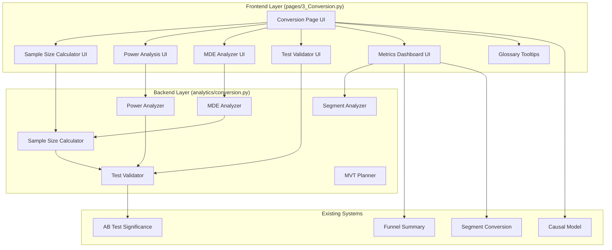

# Design Document: CRO Analytics Enhancement

## Overview

This design document specifies the technical architecture for enhancing the churnOS conversion optimization module with comprehensive Conversion Rate Optimization (CRO) analytics capabilities. The enhancement adds advanced statistical tools including sample size calculators, statistical power analysis, MDE (Minimum Detectable Effect) analyzers, test validation systems, and a comprehensive CRO metrics dashboard.

### Goals

1. **Enable Data-Driven Test Planning**: Provide tools to calculate required sample sizes, estimate test duration, and understand statistical power before running tests
2. **Improve Test Reliability**: Validate test results against statistical best practices and flag potentially unreliable results
3. **Educational Integration**: Embed CRO knowledge through interactive glossaries and contextual recommendations
4. **Business Impact Visibility**: Connect CRO improvements to CLV and revenue impact through the existing causal business model
5. **Maintain UI Consistency**: Preserve the terminal-style Bloomberg aesthetic across all new components

### Design Principles

- **Statistical Rigor**: All calculations follow established statistical formulas (two-proportion z-tests, power analysis)
- **User Guidance**: Provide warnings, recommendations, and educational content to prevent common mistakes
- **Seamless Integration**: Extend existing modules without breaking current functionality
- **Performance**: Calculations should complete in <100ms for responsive UI
- **Validation First**: Validate all inputs before performing calculations

## Architecture

### High-Level Component Diagram



### Module Organization

**Backend Module**: `analytics/conversion.py`
- Extends existing conversion analytics module
- Adds new functions for CRO calculations
- Maintains backward compatibility with existing functions

**Frontend Module**: `pages/3_Conversion.py`
- Extends existing Conversion page
- Adds new tabs/sections for CRO tools
- Reuses existing UI patterns and styling

## Components and Interfaces

### 1. Sample Size Calculator (`calculate_sample_size`)

**Purpose**: Calculate required sample size per variant for A/B tests

**Function Signature**:
```python
def calculate_sample_size(
    baseline_cvr: float,
    mde: float,
    power: float = 0.80,
    alpha: float = 0.05,
    n_variants: int = 2
) -> dict:
    """
    Calculate required sample size for A/B test.
    
    Args:
        baseline_cvr: Current conversion rate (0.001 to 1.0)
        mde: Minimum detectable effect as relative change (0.01 to 1.0)
        power: Statistical power (0.50 to 0.99), default 0.80
        alpha: Significance level (0.01 to 0.20), default 0.05
        n_variants: Number of variants including control (default 2)
    
    Returns:
        dict with keys:
            - sample_size_per_variant: int
            - total_sample_size: int
            - baseline_cvr: float
            - target_cvr: float (baseline * (1 + mde))
            - mde_absolute: float (absolute percentage point change)
            - mde_relative: float (relative percentage change)
            - power: float
            - alpha: float
            - warnings: list of str
    
    Raises:
        ValueError: If inputs are outside valid ranges
    """
```

**Algorithm**:
Uses the two-proportion z-test formula:
```
n = (Z_α/2 + Z_β)² * [p1(1-p1) + p2(1-p2)] / (p2 - p1)²

Where:
- p1 = baseline_cvr
- p2 = baseline_cvr * (1 + mde)
- Z_α/2 = z-score for significance level (two-tailed)
- Z_β = z-score for power (1 - beta)
```

**Validation Rules**:
- `0.001 <= baseline_cvr <= 1.0`
- `0.01 <= mde <= 1.0`
- `0.50 <= power <= 0.99`
- `0.01 <= alpha <= 0.20`
- `n_variants >= 2`

**Warnings**:
- Sample size < 350 per variant: Twyman's Law warning
- Sample size > 1,000,000 per variant: Impractical test warning
- MDE > 0.50: Large effect warning

### 2. Time Estimation (`estimate_test_duration`)

**Purpose**: Estimate days required to complete test

**Function Signature**:
```python
def estimate_test_duration(
    required_sample_size: int,
    daily_traffic: int,
    conversion_rate: float
) -> dict:
    """
    Estimate test duration in days.
    
    Args:
        required_sample_size: Total sample size needed
        daily_traffic: Daily visitor count
        conversion_rate: Expected conversion rate
    
    Returns:
        dict with keys:
            - days_to_completion: float
            - weeks_to_completion: float
            - daily_traffic: int
            - daily_conversions_expected: int
            - warnings: list of str
    """
```

**Calculation**:
```
days = required_sample_size / daily_traffic
```

**Warnings**:
- days > 90: Test duration too long
- days < 7: Recommend running at least 7 days for weekly patterns

### 3. MDE Analyzer (`calculate_mde`)

**Purpose**: Calculate minimum detectable effect for given sample size

**Function Signature**:
```python
def calculate_mde(
    baseline_cvr: float,
    sample_size_per_variant: int,
    power: float = 0.80,
    alpha: float = 0.05
) -> dict:
    """
    Calculate minimum detectable effect.
    
    Args:
        baseline_cvr: Current conversion rate
        sample_size_per_variant: Sample size per variant
        power: Statistical power
        alpha: Significance level
    
    Returns:
        dict with keys:
            - mde_relative: float (relative % change)
            - mde_absolute: float (absolute percentage points)
            - target_cvr: float
            - baseline_cvr: float
            - sample_size_per_variant: int
    """
```

**Algorithm**:
Inverse of sample size calculation - solve for (p2 - p1) given n:
```
(p2 - p1) = (Z_α/2 + Z_β) * sqrt([p1(1-p1) + p2(1-p2)] / n)
```

### 4. Statistical Power Calculator (`calculate_power`)

**Purpose**: Calculate statistical power for given test parameters

**Function Signature**:
```python
def calculate_power(
    baseline_cvr: float,
    effect_size: float,
    sample_size_per_variant: int,
    alpha: float = 0.05
) -> dict:
    """
    Calculate statistical power.
    
    Args:
        baseline_cvr: Current conversion rate
        effect_size: Expected relative change
        sample_size_per_variant: Sample size per variant
        alpha: Significance level
    
    Returns:
        dict with keys:
            - power: float (0 to 1)
            - power_pct: float (0 to 100)
            - beta: float (Type II error rate)
            - alpha: float (Type I error rate)
            - warnings: list of str
    """
```

**Algorithm**:
```
Z = (p2 - p1) / SE
power = Φ(Z - Z_α/2)

Where:
- SE = sqrt([p1(1-p1) + p2(1-p2)] / n)
- Φ = standard normal CDF
```

**Warnings**:
- power < 0.80: Underpowered test warning

### 5. Test Validator (`validate_test_reliability`)

**Purpose**: Validate test results against reliability criteria

**Function Signature**:
```python
def validate_test_reliability(
    control_visitors: int,
    control_conversions: int,
    variant_visitors: int,
    variant_conversions: int,
    test_duration_days: int,
    observed_lift: float
) -> dict:
    """
    Validate test reliability.
    
    Args:
        control_visitors: Control group size
        control_conversions: Control conversions
        variant_visitors: Variant group size
        variant_conversions: Variant conversions
        test_duration_days: Test duration in days
        observed_lift: Observed lift percentage
    
    Returns:
        dict with keys:
            - is_reliable: bool
            - reliability_score: int (0-100)
            - checks: dict of check results
            - warnings: list of str
            - recommendations: list of str
    """
```

**Validation Checks**:
1. **Minimum Sample Size**: >= 350 conversions per variant
2. **Minimum Duration**: >= 7 days
3. **Business Cycles**: >= 2 weekday/weekend cycles
4. **Twyman's Law**: If lift > 50%, sample size >= 1000
5. **Statistical Significance**: p-value < alpha

**Reliability Score Calculation**:
```
score = (
    sample_size_check * 30 +
    duration_check * 25 +
    business_cycle_check * 20 +
    twyman_check * 15 +
    significance_check * 10
)
```

### 6. Multivariate Test Planner (`plan_multivariate_test`)

**Purpose**: Plan multivariate tests with multiple elements and variations

**Function Signature**:
```python
def plan_multivariate_test(
    baseline_cvr: float,
    elements: list[dict],
    power: float = 0.80,
    alpha: float = 0.05
) -> dict:
    """
    Plan multivariate test.
    
    Args:
        baseline_cvr: Current conversion rate
        elements: List of dicts with keys 'name' and 'n_variations'
        power: Statistical power
        alpha: Significance level (with Bonferroni correction)
    
    Returns:
        dict with keys:
            - total_combinations: int
            - sample_size_per_combination: int
            - total_sample_size: int
            - traffic_split_pct: float
            - bonferroni_alpha: float
            - warnings: list of str
            - recommendations: list of str
    """
```

**Algorithm**:
```
total_combinations = product(n_variations for each element)
bonferroni_alpha = alpha / total_combinations
sample_size = calculate_sample_size(baseline_cvr, mde, power, bonferroni_alpha)
```

**Warnings**:
- total_combinations > 8: Too many combinations
- required_traffic > available_traffic * 2: Insufficient traffic

### 7. CRO Metrics Calculator (`calculate_cro_metrics`)

**Purpose**: Calculate comprehensive CRO metrics from funnel data

**Function Signature**:
```python
def calculate_cro_metrics(
    funnel_df: pd.DataFrame,
    date_range: tuple[str, str] = None
) -> dict:
    """
    Calculate CRO metrics.
    
    Args:
        funnel_df: Funnel events DataFrame
        date_range: Optional (start_date, end_date) tuple
    
    Returns:
        dict with keys:
            - bounce_rate: float
            - above_fold_engagement: float
            - below_fold_engagement: float
            - primary_conversion_rate: float
            - secondary_conversion_rates: dict
            - ctr_by_element: dict
            - avg_time_on_page: float
    """
```

### 8. Segment Performance Analyzer (`analyze_segment_performance`)

**Purpose**: Analyze conversion performance by segments with recommendations

**Function Signature**:
```python
def analyze_segment_performance(
    funnel_df: pd.DataFrame,
    segment_by: str
) -> dict:
    """
    Analyze segment performance with recommendations.
    
    Args:
        funnel_df: Funnel events DataFrame
        segment_by: Dimension to segment by ('device', 'source', 'region', 'visitor_type')
    
    Returns:
        dict with keys:
            - segments: pd.DataFrame with conversion rates
            - overall_cvr: float
            - underperforming_segments: list of dicts
            - recommendations: list of str
    """
```

**Underperforming Criteria**:
- Segment CVR < Overall CVR * 0.80 (20% below average)
- Segment CVR < Overall CVR * 0.70 (30% below average for traffic sources)

**Recommendations by Segment Type**:
- **Mobile (30%+ below desktop)**: Page load speed, form simplification, touch targets
- **Desktop**: Above-fold content, trust signals, detailed product info
- **Tablet**: Hybrid mobile/desktop optimization
- **Traffic Source**: Channel-specific landing pages, message match

### 9. Glossary System (`get_cro_glossary`)

**Purpose**: Provide educational content and definitions

**Function Signature**:
```python
def get_cro_glossary() -> dict:
    """
    Get CRO glossary with definitions, examples, and pitfalls.
    
    Returns:
        dict mapping term names to dicts with keys:
            - definition: str
            - when_to_use: str
            - example: str
            - common_pitfalls: str
    """
```

**Terms Covered** (20 total):
1. Baseline_CVR
2. MDE (Minimum Detectable Effect)
3. Statistical_Power
4. Significance_Level
5. Type_I_Error
6. Type_II_Error
7. Twyman_Law
8. Bounce_Rate
9. CTR (Click-Through Rate)
10. Primary_Conversion
11. Secondary_Conversion
12. Confidence_Interval
13. Effect_Size
14. Sample_Size
15. Traffic_Source
16. Visitor_Segment
17. Multivariate_Test
18. A/B_Test
19. Funnel_Step
20. Lift

## Data Models

### TestConfiguration

```python
@dataclass
class TestConfiguration:
    """Configuration for an A/B or multivariate test."""
    baseline_cvr: float
    mde: float
    power: float = 0.80
    alpha: float = 0.05
    n_variants: int = 2
    daily_traffic: int = 0
    
    def validate(self) -> list[str]:
        """Validate configuration and return list of errors."""
        errors = []
        if not (0.001 <= self.baseline_cvr <= 1.0):
            errors.append("baseline_cvr must be between 0.001 and 1.0")
        if not (0.01 <= self.mde <= 1.0):
            errors.append("mde must be between 0.01 and 1.0")
        if not (0.50 <= self.power <= 0.99):
            errors.append("power must be between 0.50 and 0.99")
        if not (0.01 <= self.alpha <= 0.20):
            errors.append("alpha must be between 0.01 and 0.20")
        if self.n_variants < 2:
            errors.append("n_variants must be at least 2")
        return errors
```

### TestResult

```python
@dataclass
class TestResult:
    """Results from an A/B test."""
    control_visitors: int
    control_conversions: int
    variant_visitors: int
    variant_conversions: int
    test_duration_days: int
    control_rate: float
    variant_rate: float
    lift_pct: float
    p_value: float
    is_significant: bool
    confidence_interval: tuple[float, float]
    confidence_level: float
```

### ValidationResult

```python
@dataclass
class ValidationResult:
    """Results from test reliability validation."""
    is_reliable: bool
    reliability_score: int  # 0-100
    checks: dict[str, bool]
    warnings: list[str]
    recommendations: list[str]
    
    def to_dict(self) -> dict:
        """Convert to dictionary for JSON serialization."""
        return {
            'is_reliable': self.is_reliable,
            'reliability_score': self.reliability_score,
            'checks': self.checks,
            'warnings': self.warnings,
            'recommendations': self.recommendations
        }
```

### CROMetrics

```python
@dataclass
class CROMetrics:
    """Comprehensive CRO metrics."""
    bounce_rate: float
    above_fold_engagement: float
    below_fold_engagement: float
    primary_conversion_rate: float
    secondary_conversion_rates: dict[str, float]
    ctr_by_element: dict[str, float]
    avg_time_on_page: float
    date_range: tuple[str, str]
```

## Error Handling

### Input Validation Strategy

All calculator functions follow this validation pattern:

```python
def calculate_sample_size(baseline_cvr, mde, power, alpha, n_variants):
    # 1. Validate inputs
    errors = []
    if not (0.001 <= baseline_cvr <= 1.0):
        errors.append("Baseline CVR must be between 0.1% and 100%")
    if not (0.01 <= mde <= 1.0):
        errors.append("MDE must be between 1% and 100%")
    # ... more validations
    
    if errors:
        raise ValueError("; ".join(errors))
    
    # 2. Perform calculation
    # 3. Generate warnings (non-fatal)
    # 4. Return result with warnings
```

### Error Types

1. **ValueError**: Invalid input parameters (fatal, stops calculation)
2. **Warning**: Potentially problematic but valid inputs (non-fatal, included in results)
3. **Recommendation**: Suggestions for improvement (informational)

### User-Facing Error Messages

All error messages follow this format:
- **Clear**: State what's wrong
- **Actionable**: Explain valid range or how to fix
- **Contextual**: Explain why it matters

Example:
```
"Baseline CVR must be between 0.1% and 100%. You entered 0.05%. 
Conversion rates below 0.1% are extremely rare and may indicate data quality issues."
```

## Testing Strategy

### Unit Testing Approach

**Test Coverage Goals**:
- All calculation functions: 100% coverage
- All validation logic: 100% coverage
- Edge cases and boundary conditions: Comprehensive coverage
- Integration points: Key scenarios covered

**Test Organization**:
```
tests/
  test_conversion_calculations.py  # Sample size, MDE, power calculations
  test_conversion_validation.py    # Input validation, test reliability
  test_conversion_integration.py   # Integration with existing functions
  test_conversion_ui.py           # UI component tests (if applicable)
```

### Unit Test Examples

**Sample Size Calculation Tests**:
```python
def test_sample_size_typical_ecommerce():
    """Test sample size for typical e-commerce scenario."""
    result = calculate_sample_size(
        baseline_cvr=0.03,  # 3% CVR
        mde=0.10,           # 10% relative improvement
        power=0.80,
        alpha=0.05
    )
    assert result['sample_size_per_variant'] > 0
    assert result['total_sample_size'] == result['sample_size_per_variant'] * 2
    assert len(result['warnings']) == 0

def test_sample_size_small_sample_warning():
    """Test Twyman's Law warning for small samples."""
    result = calculate_sample_size(
        baseline_cvr=0.50,  # 50% CVR (high)
        mde=0.20,           # 20% improvement
        power=0.80,
        alpha=0.05
    )
    assert any('Twyman' in w for w in result['warnings'])

def test_sample_size_invalid_baseline():
    """Test validation for invalid baseline CVR."""
    with pytest.raises(ValueError, match="Baseline CVR must be between"):
        calculate_sample_size(
            baseline_cvr=1.5,  # Invalid: > 100%
            mde=0.10,
            power=0.80,
            alpha=0.05
        )

def test_sample_size_boundary_conditions():
    """Test boundary conditions for sample size calculation."""
    # Minimum valid inputs
    result = calculate_sample_size(
        baseline_cvr=0.001,
        mde=0.01,
        power=0.50,
        alpha=0.20
    )
    assert result['sample_size_per_variant'] > 0
    
    # Maximum valid inputs
    result = calculate_sample_size(
        baseline_cvr=1.0,
        mde=1.0,
        power=0.99,
        alpha=0.01
    )
    assert result['sample_size_per_variant'] > 0
```

**MDE Calculation Tests**:
```python
def test_mde_inverse_of_sample_size():
    """Test that MDE calculation is inverse of sample size."""
    baseline_cvr = 0.03
    mde_input = 0.10
    power = 0.80
    alpha = 0.05
    
    # Calculate sample size for given MDE
    ss_result = calculate_sample_size(baseline_cvr, mde_input, power, alpha)
    sample_size = ss_result['sample_size_per_variant']
    
    # Calculate MDE for that sample size
    mde_result = calculate_mde(baseline_cvr, sample_size, power, alpha)
    
    # MDE should match original input (within tolerance)
    assert abs(mde_result['mde_relative'] - mde_input) < 0.01

def test_mde_larger_sample_smaller_mde():
    """Test that larger samples can detect smaller effects."""
    baseline_cvr = 0.03
    power = 0.80
    alpha = 0.05
    
    mde_small = calculate_mde(baseline_cvr, 10000, power, alpha)
    mde_large = calculate_mde(baseline_cvr, 1000, power, alpha)
    
    assert mde_small['mde_relative'] < mde_large['mde_relative']
```

**Power Calculation Tests**:
```python
def test_power_increases_with_sample_size():
    """Test that power increases with larger samples."""
    baseline_cvr = 0.03
    effect_size = 0.10
    alpha = 0.05
    
    power_small = calculate_power(baseline_cvr, effect_size, 1000, alpha)
    power_large = calculate_power(baseline_cvr, effect_size, 10000, alpha)
    
    assert power_large['power'] > power_small['power']

def test_power_underpowered_warning():
    """Test warning for underpowered tests."""
    result = calculate_power(
        baseline_cvr=0.03,
        effect_size=0.05,  # Small effect
        sample_size_per_variant=500,  # Small sample
        alpha=0.05
    )
    assert result['power'] < 0.80
    assert any('underpowered' in w.lower() for w in result['warnings'])
```

**Test Validation Tests**:
```python
def test_validate_reliable_test():
    """Test validation of a reliable test."""
    result = validate_test_reliability(
        control_visitors=10000,
        control_conversions=350,
        variant_visitors=10000,
        variant_conversions=420,
        test_duration_days=14,
        observed_lift=20.0
    )
    assert result['is_reliable'] == True
    assert result['reliability_score'] >= 80

def test_validate_unreliable_small_sample():
    """Test validation flags small sample sizes."""
    result = validate_test_reliability(
        control_visitors=1000,
        control_conversions=30,  # < 350
        variant_visitors=1000,
        variant_conversions=36,
        test_duration_days=14,
        observed_lift=20.0
    )
    assert result['is_reliable'] == False
    assert 'sample size' in ' '.join(result['warnings']).lower()

def test_validate_twyman_violation():
    """Test Twyman's Law violation detection."""
    result = validate_test_reliability(
        control_visitors=500,
        control_conversions=50,
        variant_visitors=500,
        variant_conversions=100,  # 100% lift
        test_duration_days=14,
        observed_lift=100.0
    )
    assert 'Twyman' in ' '.join(result['warnings'])
```

**Segment Analysis Tests**:
```python
def test_segment_analysis_identifies_underperformers():
    """Test that segment analysis identifies underperforming segments."""
    # Create test data with mobile underperforming
    funnel_df = pd.DataFrame({
        'session_id': range(1000),
        'device': ['mobile'] * 500 + ['desktop'] * 500,
        'funnel_step': ['Purchase'] * 150 + ['Visit'] * 350 + 
                       ['Purchase'] * 200 + ['Visit'] * 300
    })
    
    result = analyze_segment_performance(funnel_df, 'device')
    
    # Mobile should be flagged as underperforming
    underperforming = [s['segment'] for s in result['underperforming_segments']]
    assert 'mobile' in underperforming
    assert len(result['recommendations']) > 0
```

**Integration Tests**:
```python
def test_integration_with_existing_ab_test():
    """Test that new validation integrates with existing ab_test_significance."""
    from analytics.conversion import ab_test_significance
    
    # Run existing A/B test
    ab_result = ab_test_significance(
        control_visitors=10000,
        control_conversions=350,
        variant_visitors=10000,
        variant_conversions=420
    )
    
    # Validate with new validator
    validation = validate_test_reliability(
        control_visitors=10000,
        control_conversions=350,
        variant_visitors=10000,
        variant_conversions=420,
        test_duration_days=14,
        observed_lift=ab_result['lift_pct']
    )
    
    # Both should agree on significance
    assert ab_result['is_significant'] == validation['checks']['statistical_significance']
```

### Property-Based Testing Assessment

**Is PBT Appropriate for This Feature?**

This feature involves **statistical calculations and data transformations** with clear mathematical properties. PBT is appropriate for testing the core calculation functions.

**PBT-Suitable Components**:
1. Sample size calculations (mathematical properties)
2. MDE calculations (inverse relationship with sample size)
3. Power calculations (monotonic relationships)
4. Input validation (boundary conditions)

**NOT PBT-Suitable Components**:
1. UI rendering (use snapshot tests)
2. Streamlit page layout (use integration tests)
3. Glossary content (use example-based tests)
4. Warning message generation (use example-based tests)

Since PBT IS applicable to the core calculation logic, I will proceed with the prework analysis.


## Correctness Properties

*A property is a characteristic or behavior that should hold true across all valid executions of a system—essentially, a formal statement about what the system should do. Properties serve as the bridge between human-readable specifications and machine-verifiable correctness guarantees.*

### Property Reflection

After analyzing all acceptance criteria, I identified the following areas of potential redundancy:

**Input Validation Properties (1.2-1.5, 2.2)**: All follow the same pattern - validate parameter is in range. These can be combined into a single comprehensive validation property.

**Warning Generation Properties (1.6, 2.3, 3.1, 5.3, 10.4)**: All follow the pattern of conditional warning based on threshold. These share the same underlying logic but apply to different thresholds.

**Segmented Conversion Rate Properties (9.1-9.4, 20.1-20.5)**: All calculate conversion rates by different dimensions. These can be combined into a single property about segmented calculations.

**Relationship Properties (5.5, 5.6)**: These verify mathematical relationships (alpha = Type I error, beta = 1 - power) that are inherent to the definitions.

**After reflection, I will consolidate redundant properties while ensuring each remaining property provides unique validation value.**

### Property 1: Sample Size Calculation Correctness

*For any* valid baseline conversion rate, minimum detectable effect, statistical power, and significance level, the calculated sample size SHALL be a positive integer that satisfies the two-proportion z-test formula within numerical precision tolerance.

**Validates: Requirements 1.1, 1.8**

### Property 2: Input Validation Completeness

*For any* input parameter to any calculator function, values within the specified valid range SHALL be accepted, and values outside the valid range SHALL raise a ValueError with a descriptive message indicating the valid range.

**Validates: Requirements 1.2, 1.3, 1.4, 1.5, 2.2, 18.1, 18.2, 18.3, 18.4, 18.5**

### Property 3: Calculation Idempotence

*For any* valid input parameters to any calculator function, calling the function multiple times with identical inputs SHALL produce identical outputs.

**Validates: Requirements 1.9**

### Property 4: Total Sample Size Arithmetic

*For any* valid test configuration with n variants, the total required sample size SHALL equal the sample size per variant multiplied by the number of variants.

**Validates: Requirements 1.7**

### Property 5: Threshold-Based Warning Generation

*For any* calculated metric with an associated warning threshold, a warning SHALL appear in the results if and only if the metric crosses the threshold in the problematic direction.

**Validates: Requirements 1.6, 2.3, 3.1, 5.3, 10.4, 11.2**

### Property 6: Time Estimation Arithmetic

*For any* required sample size and positive daily traffic volume, the estimated days to completion SHALL equal the required sample size divided by the daily traffic volume, rounded to one decimal place.

**Validates: Requirements 2.1, 2.5**

### Property 7: Twyman's Law Compound Condition

*For any* test result where observed lift exceeds 50% AND sample size per variant is less than 1000, the Test_Validator SHALL flag the result as potentially unreliable due to Twyman's Law.

**Validates: Requirements 3.3**

### Property 8: MDE-Sample Size Inverse Relationship

*For any* baseline conversion rate, statistical power, and significance level, calculating the sample size for a given MDE and then calculating the MDE for that sample size SHALL return the original MDE within numerical precision tolerance (round-trip property).

**Validates: Requirements 4.1, 4.6**

### Property 9: MDE Dual Representation Consistency

*For any* calculated MDE, the absolute MDE (in percentage points) SHALL equal the baseline conversion rate multiplied by the relative MDE (as a decimal), ensuring both representations are mathematically consistent.

**Validates: Requirements 4.2**

### Property 10: MDE Monotonicity with Sample Size

*For any* fixed baseline conversion rate, statistical power, and significance level, as sample size increases, the minimum detectable effect SHALL decrease (larger samples can detect smaller effects).

**Validates: Requirements 4.1**

### Property 11: Power Monotonicity with Sample Size

*For any* fixed baseline conversion rate, effect size, and significance level, as sample size increases, statistical power SHALL increase monotonically.

**Validates: Requirements 5.1**

### Property 12: Error Rate Relationships

*For any* power calculation, Type I error (alpha) SHALL equal the significance level, and Type II error (beta) SHALL equal 1 minus the statistical power.

**Validates: Requirements 5.5, 5.6**

### Property 13: Confidence Interval and Significance Consistency

*For any* A/B test result, if the confidence interval for the lift includes zero, the test SHALL be marked as not statistically significant, and if the confidence interval excludes zero, the test SHALL be marked as statistically significant.

**Validates: Requirements 6.4**

### Property 14: Confidence Interval Width Monotonicity

*For any* test result, as the confidence level increases, the confidence interval width SHALL increase (higher confidence requires wider intervals).

**Validates: Requirements 6.2**

### Property 15: Conversion Rate Calculation Consistency

*For any* dataset with visitors and conversions, the conversion rate SHALL equal conversions divided by visitors, expressed as a percentage, and this calculation SHALL be consistent across all segments and metrics.

**Validates: Requirements 7.1, 7.2, 7.3, 7.4, 9.1, 9.2, 9.3, 9.4, 20.1, 20.2, 20.3, 20.4, 20.5**

### Property 16: Segment Sorting Correctness

*For any* segmented conversion analysis, the output segments SHALL be sorted by conversion rate in descending order (highest performing segments first).

**Validates: Requirements 9.5, 20.6**

### Property 17: Underperformance Threshold Detection

*For any* segment with a conversion rate more than 20% below the overall average (or 30% for traffic sources), the segment SHALL be flagged as underperforming and included in the underperforming segments list.

**Validates: Requirements 9.6, 20.7**

### Property 18: Multivariate Combination Calculation

*For any* multivariate test with n elements where element i has v_i variations, the total number of combinations SHALL equal the product of all v_i values.

**Validates: Requirements 10.1**

### Property 19: Multivariate Traffic Split Uniformity

*For any* multivariate test with n combinations, the traffic split percentage for each combination SHALL equal 100/n, and the sum of all traffic splits SHALL equal 100%.

**Validates: Requirements 10.3**

### Property 20: Bonferroni Correction Application

*For any* multivariate test with n combinations and significance level alpha, the Bonferroni-corrected significance level SHALL equal alpha divided by n.

**Validates: Requirements 10.5**

### Property 21: Test Reliability Score Bounds

*For any* test validation result, the reliability score SHALL be an integer between 0 and 100 inclusive, and SHALL increase monotonically as more reliability checks pass.

**Validates: Requirements 11.7**

### Property 22: Reliability Check Completeness

*For any* test result, the Test_Validator SHALL perform all five reliability checks (minimum sample size, minimum duration, business cycles, Twyman's Law, statistical significance) and report the status of each check.

**Validates: Requirements 11.1, 11.2, 11.3, 11.4, 11.5**

### Property 23: CLV Impact Proportionality

*For any* CVR improvement percentage, the calculated impact on customer acquisition SHALL be proportional to the improvement (doubling CVR improvement doubles customer acquisition impact), assuming constant traffic.

**Validates: Requirements 13.1**

### Property 24: Causal Model Integration Consistency

*For any* CVR improvement scenario, the monthly revenue impact and 24-month CLV impact SHALL be calculated using the same causal business model parameters, ensuring consistency between short-term and long-term projections.

**Validates: Requirements 13.2, 13.3**

### Property 25: ROI Calculation Correctness

*For any* optimization scenario with calculated revenue gain and known cost, the ROI SHALL equal (revenue_gain - cost) / cost, expressed as a percentage.

**Validates: Requirements 13.4**


## Testing Strategy

### Dual Testing Approach

This feature requires both **unit tests** for specific examples and edge cases, and **property-based tests** for universal properties across all inputs.

**Unit Tests** will focus on:
- Specific examples demonstrating correct behavior (e.g., typical e-commerce CVR of 3%, 10% MDE)
- Edge cases at boundary conditions (minimum/maximum valid inputs)
- Error message content and formatting
- Integration points with existing functions
- UI component rendering and interaction

**Property-Based Tests** will focus on:
- Universal mathematical properties (idempotence, monotonicity, inverse relationships)
- Input validation across the entire valid range
- Calculation correctness for randomly generated valid inputs
- Threshold-based warning generation
- Arithmetic relationships (totals, splits, proportions)

### Property-Based Testing Configuration

**Library Selection**: Use `hypothesis` for Python property-based testing

**Test Configuration**:
- Minimum 100 iterations per property test (due to randomization)
- Each property test MUST reference its design document property using a comment tag
- Tag format: `# Feature: cro-analytics-enhancement, Property {number}: {property_text}`

**Example Property Test Structure**:
```python
from hypothesis import given, strategies as st
import pytest

# Feature: cro-analytics-enhancement, Property 1: Sample Size Calculation Correctness
@given(
    baseline_cvr=st.floats(min_value=0.001, max_value=1.0),
    mde=st.floats(min_value=0.01, max_value=1.0),
    power=st.floats(min_value=0.50, max_value=0.99),
    alpha=st.floats(min_value=0.01, max_value=0.20)
)
def test_sample_size_calculation_correctness(baseline_cvr, mde, power, alpha):
    """Property 1: Sample size calculation produces valid results."""
    result = calculate_sample_size(baseline_cvr, mde, power, alpha)
    
    # Sample size must be positive integer
    assert result['sample_size_per_variant'] > 0
    assert isinstance(result['sample_size_per_variant'], int)
    
    # Verify mathematical correctness (within tolerance)
    # ... verification logic ...

# Feature: cro-analytics-enhancement, Property 3: Calculation Idempotence
@given(
    baseline_cvr=st.floats(min_value=0.001, max_value=1.0),
    mde=st.floats(min_value=0.01, max_value=1.0),
    power=st.floats(min_value=0.50, max_value=0.99),
    alpha=st.floats(min_value=0.01, max_value=0.20)
)
def test_calculation_idempotence(baseline_cvr, mde, power, alpha):
    """Property 3: Calling function twice with same inputs produces same output."""
    result1 = calculate_sample_size(baseline_cvr, mde, power, alpha)
    result2 = calculate_sample_size(baseline_cvr, mde, power, alpha)
    
    assert result1 == result2

# Feature: cro-analytics-enhancement, Property 8: MDE-Sample Size Inverse Relationship
@given(
    baseline_cvr=st.floats(min_value=0.001, max_value=1.0),
    mde=st.floats(min_value=0.01, max_value=0.50),  # Limit MDE for practical sample sizes
    power=st.floats(min_value=0.70, max_value=0.90),
    alpha=st.floats(min_value=0.01, max_value=0.10)
)
def test_mde_sample_size_round_trip(baseline_cvr, mde, power, alpha):
    """Property 8: MDE and sample size calculations are inverses."""
    # Calculate sample size for given MDE
    ss_result = calculate_sample_size(baseline_cvr, mde, power, alpha)
    sample_size = ss_result['sample_size_per_variant']
    
    # Calculate MDE for that sample size
    mde_result = calculate_mde(baseline_cvr, sample_size, power, alpha)
    
    # Should get original MDE back (within 1% tolerance)
    assert abs(mde_result['mde_relative'] - mde) / mde < 0.01
```

### Test Organization

```
tests/
  unit/
    test_sample_size_calculator.py       # Unit tests for sample size calculations
    test_mde_analyzer.py                  # Unit tests for MDE analysis
    test_power_analyzer.py                # Unit tests for power calculations
    test_test_validator.py                # Unit tests for test validation
    test_mvt_planner.py                   # Unit tests for multivariate planning
    test_segment_analyzer.py              # Unit tests for segment analysis
    test_cro_metrics.py                   # Unit tests for CRO metrics
    test_glossary.py                      # Unit tests for glossary content
  
  property/
    test_calculation_properties.py        # Property tests for mathematical correctness
    test_validation_properties.py         # Property tests for input validation
    test_relationship_properties.py       # Property tests for mathematical relationships
    test_monotonicity_properties.py       # Property tests for monotonic relationships
  
  integration/
    test_conversion_page_integration.py   # Integration tests for UI components
    test_causal_model_integration.py      # Integration tests with causal model
    test_existing_functions.py            # Regression tests for existing functions
```

### Coverage Goals

- **Calculation Functions**: 100% line coverage, 100% branch coverage
- **Validation Logic**: 100% line coverage, 100% branch coverage
- **Property Tests**: All 25 correctness properties implemented
- **Integration Points**: Key scenarios covered (existing functions still work, causal model integration)

### Test Execution

**Unit Tests**: Run on every commit
```bash
pytest tests/unit/ -v --cov=analytics.conversion --cov-report=html
```

**Property Tests**: Run on every commit (100 iterations per property)
```bash
pytest tests/property/ -v --hypothesis-show-statistics
```

**Integration Tests**: Run before merge to main
```bash
pytest tests/integration/ -v
```

### Performance Requirements

All calculation functions must complete in <100ms for responsive UI:
- Sample size calculation: <10ms
- MDE calculation: <10ms
- Power calculation: <10ms
- Test validation: <50ms
- Segment analysis: <100ms (depends on data size)

Performance tests should verify these requirements:
```python
def test_sample_size_performance():
    """Verify sample size calculation completes in <10ms."""
    import time
    start = time.time()
    calculate_sample_size(0.03, 0.10, 0.80, 0.05)
    duration = time.time() - start
    assert duration < 0.010  # 10ms
```

## Implementation Plan

### Phase 1: Backend Analytics Functions (Week 1)

**Files to Modify**: `analytics/conversion.py`

**New Functions to Add**:
1. `calculate_sample_size()` - Sample size calculator
2. `estimate_test_duration()` - Time estimation
3. `calculate_mde()` - MDE analyzer
4. `calculate_power()` - Power calculator
5. `validate_test_reliability()` - Test validator
6. `plan_multivariate_test()` - MVT planner
7. `calculate_cro_metrics()` - CRO metrics calculator
8. `analyze_segment_performance()` - Segment analyzer
9. `get_cro_glossary()` - Glossary content

**Dependencies**:
- `scipy.stats` - For statistical distributions (already imported)
- `numpy` - For numerical calculations (already imported)
- `pandas` - For data manipulation (already imported)

**Testing**: Write unit tests and property tests for all functions

### Phase 2: Frontend UI Components (Week 2)

**Files to Modify**: `pages/3_Conversion.py`

**New UI Sections to Add**:
1. **Sample Size Calculator Tab**
   - Input fields for baseline CVR, MDE, power, alpha
   - Display calculated sample size and time estimates
   - Show warnings (Twyman's Law, impractical tests)
   
2. **Power Analysis Tab**
   - Input fields for baseline CVR, effect size, sample size, alpha
   - Display calculated power
   - Visual representation of Type I/II errors
   - Show warnings for underpowered tests

3. **MDE Analyzer Tab**
   - Input fields for baseline CVR, sample size, power, alpha
   - Display calculated MDE (absolute and relative)
   - Interactive chart showing sample size vs MDE relationship
   - Context note for typical e-commerce CVR

4. **Test Validator Section**
   - Input fields for test results
   - Display reliability score and check results
   - Show warnings and recommendations

5. **CRO Metrics Dashboard Tab**
   - Display bounce rate, CTR, engagement rates
   - Display primary and secondary conversion rates
   - Contextual help for each metric
   - Date range filter

6. **MVT Planner Tab**
   - Input fields for elements and variations
   - Display total combinations and required sample size
   - Show traffic split and warnings

7. **Glossary Integration**
   - Add tooltip system for all CRO terms
   - Link to full glossary page

**UI Patterns**:
- Use existing terminal-style CSS classes
- Use existing PLOTLY_THEME for charts
- Use `st.columns()` for layout
- Use `st.expander()` for collapsible sections
- Use `st.metric()` for KPI display
- Use `st.tabs()` for organizing content

**Testing**: Integration tests for UI components

### Phase 3: Integration and Polish (Week 3)

**Tasks**:
1. Integrate CVR improvement simulator with causal business model
2. Add device-specific and traffic source recommendations
3. Implement glossary tooltip system
4. Add best practices recommendations throughout UI
5. Performance optimization
6. Documentation updates
7. User acceptance testing

**Testing**: End-to-end integration tests, performance tests

## Security and Privacy Considerations

**Data Privacy**:
- All calculations performed client-side (no data sent to external services)
- Funnel data generated locally using existing generator
- No PII collected or stored

**Input Validation**:
- All user inputs validated before calculations
- Prevent injection attacks through proper input sanitization
- Numeric inputs bounded to valid ranges

**Error Handling**:
- Graceful degradation if calculations fail
- Clear error messages without exposing internal details
- Logging of errors for debugging (without sensitive data)

## Performance Optimization

**Calculation Caching**:
- Cache sample size calculations for common parameter combinations
- Cache MDE calculations for common sample sizes
- Use `@st.cache_data` for expensive calculations in Streamlit

**Data Processing**:
- Use vectorized operations with pandas/numpy
- Avoid loops where possible
- Limit segment analysis to reasonable data sizes

**UI Responsiveness**:
- Use Streamlit's reactive model efficiently
- Debounce slider inputs to avoid excessive recalculation
- Show loading indicators for calculations >100ms

## Deployment Considerations

**Backward Compatibility**:
- All existing functions in `analytics/conversion.py` remain unchanged
- Existing Conversion page functionality preserved
- New features added as additional tabs/sections

**Configuration**:
- No new configuration files required
- Uses existing CSS and theme configuration
- Glossary content embedded in code (no external files)

**Dependencies**:
- No new Python package dependencies required
- All required packages already in `requirements.txt`

**Testing Before Deployment**:
1. Run full test suite (unit + property + integration)
2. Verify existing functionality still works
3. Test on sample data
4. Performance testing
5. Cross-browser testing (if applicable)

## Future Enhancements

**Potential Future Features** (not in current scope):
1. **Sequential Testing**: Support for sequential A/B tests with early stopping rules
2. **Bayesian A/B Testing**: Alternative to frequentist approach
3. **Test History**: Store and analyze past test results
4. **Automated Recommendations**: ML-based optimization suggestions
5. **Multi-Armed Bandit**: Dynamic traffic allocation
6. **Experiment Calendar**: Plan and schedule multiple tests
7. **Cost-Benefit Analysis**: ROI calculator for test investments
8. **Statistical Process Control**: Monitor conversion rates over time

## Appendix: Statistical Formulas

### Sample Size Calculation (Two-Proportion Z-Test)

```
n = (Z_α/2 + Z_β)² × [p₁(1-p₁) + p₂(1-p₂)] / (p₂ - p₁)²

Where:
- n = sample size per variant
- p₁ = baseline conversion rate
- p₂ = target conversion rate = p₁ × (1 + MDE)
- Z_α/2 = z-score for significance level (two-tailed)
- Z_β = z-score for power (1 - β)
- α = significance level (Type I error rate)
- β = Type II error rate = 1 - power
```

### Minimum Detectable Effect (MDE)

```
MDE = (Z_α/2 + Z_β) × √([p₁(1-p₁) + p₂(1-p₂)] / n)

Solved iteratively since p₂ depends on MDE
```

### Statistical Power

```
Z = (p₂ - p₁) / SE
Power = Φ(Z - Z_α/2)

Where:
- SE = √([p₁(1-p₁) + p₂(1-p₂)] / n)
- Φ = standard normal cumulative distribution function
```

### Confidence Interval for Lift

```
CI = (p₂ - p₁) ± Z_α/2 × SE

Where:
- SE = √(p₁(1-p₁)/n₁ + p₂(1-p₂)/n₂)
```

### Cohen's h (Effect Size for Proportions)

```
h = 2 × (arcsin(√p₂) - arcsin(√p₁))

Interpretation:
- |h| < 0.2: small effect
- 0.2 ≤ |h| < 0.5: medium effect
- |h| ≥ 0.5: large effect
```

### Bonferroni Correction (Multivariate Tests)

```
α_corrected = α / k

Where:
- k = number of comparisons (combinations in MVT)
```

## Glossary Reference

The following 20 CRO terms will have interactive tooltips and full glossary entries:

1. **Baseline_CVR**: Current conversion rate before optimization
2. **MDE**: Minimum Detectable Effect - smallest reliably detectable change
3. **Statistical_Power**: Probability of detecting a true effect (typically 80%)
4. **Significance_Level**: Threshold for rejecting null hypothesis (typically 5%)
5. **Type_I_Error**: False positive - detecting effect that doesn't exist (α)
6. **Type_II_Error**: False negative - missing a real effect (β)
7. **Twyman_Law**: Extreme results from small samples are likely unreliable
8. **Bounce_Rate**: Percentage of single-page sessions
9. **CTR**: Click-Through Rate - percentage clicking an element
10. **Primary_Conversion**: Main business goal (purchase, signup)
11. **Secondary_Conversion**: Supporting goals (newsletter, wishlist)
12. **Confidence_Interval**: Range likely containing true effect
13. **Effect_Size**: Magnitude of difference (Cohen's h for proportions)
14. **Sample_Size**: Number of observations needed for reliable results
15. **Traffic_Source**: Origin of visitors (organic, paid, referral, direct, social)
16. **Visitor_Segment**: Group with shared characteristics
17. **Multivariate_Test**: Testing multiple elements simultaneously
18. **A/B_Test**: Comparing two versions (control vs variant)
19. **Funnel_Step**: Stage in conversion process
20. **Lift**: Percentage improvement over baseline

---

**Document Version**: 1.0  
**Last Updated**: 2024  
**Status**: Ready for Implementation
