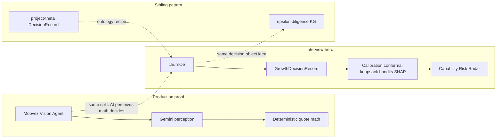
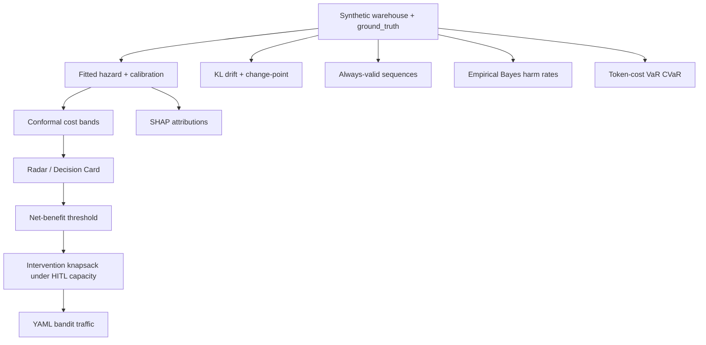

# Interview showcase plan (hiring)

**Status:** active build plan · August 2026  
**Audience:** hiring managers / technical interviews  
**Goal:** prove genAI-for-mathematics (Moovez) + shipped decision OS (churnOS) in a rehearsed 5-minute loop.

Related: [`math/README.md`](math/README.md) (dojo contract) · [`math/phase3_backlog.md`](math/phase3_backlog.md) (shipped Phase 3) · [`honesty.md`](honesty.md)

---

## Verdict

**churnOS is the interview hero.** Do not prioritize adding more ontology to [project-epsilon](https://github.com/b-lavania/project-epsilon) for this goal.

Why:

- churnOS already has the [project-theta](https://github.com/b-lavania/project-theta) recipe: taxonomy → `semantics.yaml` → `GrowthDecisionRecord` → Decision Card → outcome flywheel ([`README.md`](../README.md)).
- Math Phases 0–2 are shipped; this plan **expands** beyond the thin [`math/phase3_backlog.md`](math/phase3_backlog.md) with interview-grade methods that obey the dojo contract in [`math/README.md`](math/README.md).
- Epsilon already has `ontology/diligence/`; more schema there does not prove “genAI for mathematics.”
- [Moovez Vision Agent](https://github.com/moovezceo/Moovez-Vision-Agent) is the live **LLM → deterministic math** split ([demo](https://visionagent.streamlit.app/)).

---

## Interview thesis (one sentence)

> I use LLMs where perception/language helps, keep economics and inference in auditable math, and ship the glue as an ontology-backed `DecisionRecord` — proven in Moovez quotes, modeled end-to-end in churnOS.

---

## What hiring managers see in 5 minutes

1. **90s — Moovez (genAI for math):** photo → Gemini items → calculator quote; emphasize *no LLM in pricing*.
2. **3min — churnOS (shipped decision OS):** Profile → generate → Radar by `cost_of_leaving_live_usd` (with conformal band) → edit `semantics.yaml` / decision threshold → regenerate → Flywheel write-back; flip `math_mode` heuristic vs rigorous; open Calibration or Drift lab if asked “how do you know?”.
3. **30s — siblings:** “Same DecisionRecord pattern in physical ops (theta) and energy diligence (epsilon).”

---

## Already shipped (do not rebuild)

Baseline from Phases 0–2 + Phase 3 shipped items: Beta–Binomial; discrete-time/Cox-style hazard (teaching coeffs); survival-priced economics; SPRT version compare; clustered power / CUPED / FDR; gated uplift; BG/NBD CLV lab; MMM; Pareto ranking; Thompson bandits (teaching); Erlang-C HITL queueing; stochastic CM-NRR + conformal CPSO; EVSI review flags; competing risks. See [`math/README.md`](math/README.md) and [`math/phase3_backlog.md`](math/phase3_backlog.md).

---

## Build checklist

Every item ships as: pure `analytics/` function → unit + **ground-truth recovery** tests → Math Lab or DECIDE hook → optional GDR `evidence` when `math_mode == rigorous` → gloss in `ui/explain.py`.

### Tier 1 — must ship for interviews

- [x] **Fitted hazard + calibration** (`math-fit-calibrate`) — panel MLE on [`analytics/survival.py`](../analytics/survival.py); reliability diagram, Brier/ECE, isotonic/Platt; tests against [`data/ground_truth.py`](../data/ground_truth.py).
- [x] **Conformal risk and $ bands** (`math-conformal-cost`) — extend [`analytics/stochastic_economics.py`](../analytics/stochastic_economics.py); CI ribbons on Radar / Decision Card.
- [x] **Decision-curve / net-benefit** (`math-decision-curves`) — threshold grid; operating point from `semantics.yaml`.
- [x] **Intervention knapsack** (`math-intervention-knapsack`) — ILP under HITL capacity from [`analytics/queueing.py`](../analytics/queueing.py) + Pareto from [`analytics/pareto.py`](../analytics/pareto.py).
- [x] **YAML bandit traffic + regret** (`math-bandit-yaml`) — policy from semantics; teaching regret on Version Compare.
- [x] **SHAP / permutation attributions** (`math-shap-hazard`) — local on Decision Card; global in Math Lab.

### Tier 2 — strong differentiators

- [ ] **Always-valid confidence sequences** (`math-always-valid`) — companion to [`analytics/inference/sprt.py`](../analytics/inference/sprt.py).
- [ ] **Drift KL/JS + change-point** (`math-drift-kl`) — Version Compare + GDR drift exceptions.
- [ ] **Empirical Bayes harm shrinkage** (`math-empirical-bayes`) — extend Beta–Binomial lab.
- [ ] **Token-cost VaR/CVaR** (`math-cvar-tokens`) — Monte Carlo on [`analytics/economics.py`](../analytics/economics.py) + pricing oracle.

### Engineering + packaging

- [x] **Unit + ground-truth tests** (`math-unit-tests`) — bandits, queueing, pareto, stochastic_economics, new modules.
- [x] **Math Lab pages + nav** (`math-labs-nav`) — Calibration, Decision Curves, Drift; update [`math/README.md`](math/README.md) module table.
- [x] **GenAI contract doc** (`genai-contract-doc`) — [`genai_for_math.md`](genai_for_math.md) + README link; portfolio bridge copy.
- [x] **Interview kit** (`interview-kit`) — 5-min talk track, clone/run one-pager, LICENSE/CI/branding.

### Tier 3 — stretch (after Tier 1–2)

- [ ] HMM account-health states (Viterbi on Radar)
- [ ] Hawkes failure cascades across connectors
- [ ] DiD / synthetic control on flywheel (causal gate via `experiment_id`)
- [ ] Double ML for observational capability harm
- [ ] Weibull AFT Math Lab
- [ ] Hierarchical Bayesian partial pooling (PyMC optional)
- [ ] Connector graph centrality for blast-radius economics

### Explicitly skip

- Full econml uplift forests and geo-holdout MMM
- Live LLM owning `$` math inside churnOS
- Pretending synthetic warehouse is production telemetry
- Ontology expansion in project-epsilon for this goal

---

## Expanded math detail

### Tier 1 — decision quality (detail)

1. **Fitted hazard + probability calibration**
   - Replace fixed teaching logits in `analytics/survival.py` with panel MLE (discrete-time logit / lifelines Cox) against planted hazards in `data/ground_truth.py`.
   - Reliability diagram, Brier score, ECE; isotonic or Platt recalibration.
   - So-what: “this account’s 30d churn risk is 18% and the score is calibrated.”

2. **Conformal prediction on risk and `$` at risk**
   - Extend conformal ideas in `analytics/stochastic_economics.py` to `P(churn_30d)` and `cost_of_leaving_live_usd`.
   - So-what: “`$12k` with finite-sample band `($8k–$19k)`, not a fake Gaussian.”

3. **Decision-curve / net-benefit analysis**
   - Net benefit of rollback vs throttle vs hold across threshold grid; pick operating point from `semantics.yaml`.
   - So-what: “at your cost of false rollback, throttle wins.”

4. **Weekly intervention knapsack (OR)**
   - Integer LP / 0-1 knapsack: maximize expected `$` saved under HITL review capacity.
   - So-what: “with 3 review slots this week, take these three GDRs.”

5. **YAML-governed bandit traffic + regret**
   - Bandit allocation reads policy from semantics/rules (`analytics/bandits.py`).
   - So-what: “exploration is policy, not a hardcoded ε.”

6. **SHAP on hazard / capability-harm**
   - Local attributions on Decision Card evidence; global bar in Math Lab.
   - So-what: “delegation drop + CPSO ratio drove this risk.”

### Tier 2 — agentic + inference (detail)

7. **Always-valid confidence sequences** — anytime-valid bounds companion to SPRT; honest peeking on Version Compare.

8. **Drift: KL/JS + change-point** — outcome/taxonomy mix shifts; CUSUM or BOCPD on version quality / CPSO.

9. **Empirical Bayes / partial pooling** — shrink noisy per-capability harm rates toward global prior.

10. **Token-cost VaR / CVaR** — Monte Carlo under pricing-oracle shocks in Run Economics rigorous mode.

---

## Packaging

### GenAI story (honest)

churnOS has **no LLM SDK today**. Do not fake one.

- Add `docs/genai_for_math.md` + README link: Moovez = LLM perception + deterministic math; churnOS = YAML/policy + statistical engines; optional LLM *explains* a record using `semantics.yaml`, never owns `$`.
- Tighten portfolio case study (project-thema CONCEPT1 / Moovez page).

Optional stretch: read-only LLM rationale stub (non-authoritative).

### Interview kit

- Talk track: problem → split → demo → honesty limits.
- Clone + run one-pager; LICENSE / CI / remote branding (`churn-analysis` vs churnOS).

### Non-goals

- No live Moovez telemetry inside churnOS.
- No epsilon marketplace / living-twin overclaims in the talk track.

---

## Success criteria

- Rehearsed **5-minute loop** with at least one Tier-1 math surface visible (calibrated risk, conformal `$` band, or knapsack picks).
- Interviewer can open `ontology/` + a new math module + tests and see **policy + math + audit**.
- GenAI claim backed by **Moovez (live)**; ship/solve claim backed by **churnOS (runnable + tested)**.
- [`math/README.md`](math/README.md) module table lists every new estimand and UI surface.
